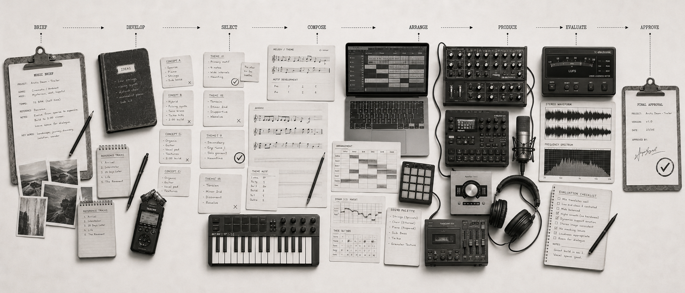

# Music Production Skills



**Direct AI music productions, not isolated generations.**

Music Production Skills gives AI coding agents a production workflow for turning musical intent into finished music while preserving the decisions worth keeping.

It supports the production process from idea to delivery:

- **Creative definition**: music briefs, reference analysis, musical direction and constraints
- **Composition**: melody, harmony, rhythm, groove, lyrics, hooks, structure and MIDI drafts
- **Arrangement**: instrumentation, section roles, density, register, transitions and energy progression
- **Production**: demos, generated or recorded material, vocals, continuation and targeted local refinement
- **Finishing and delivery**: rough mixes, mixes, masters, genuine stems where available and delivery packages
- **Quality**: stage-aware evaluation, preservation checks, technical QC and corrective routing

The workflow is designed to explore cheaply, select deliberately, approve important musical decisions, increase production fidelity only when justified, evaluate the result, and retry only what failed.

## Approval and cost control

Selection, approval and locking are different commitments.

- **Selected** means “keep developing this direction”. Selection may be made by the agent when autonomy is requested, the choice is low consequence, or one candidate clearly satisfies the constraints better than the others.
- **Approved** means downstream production may rely on the decision.
- **Locked** means downstream work may assume the decision will not change unless it is explicitly reopened.

Human selection is preferred for high-impact creative decisions such as melody, hook, lyrics, major arrangement, vocal interpretation and score direction.

Before expensive production, stabilise the decisions that materially affect it. A melody can be tested as MIDI. An arrangement can be tested with a rough section. A production direction can be tested with a short demo. Full-track generation is justified only when the unresolved question requires full-track fidelity.

Cost control comes primarily from workflow design:

```text
motif instead of full song
section instead of whole track
MIDI instead of audio
local repair instead of regeneration
demo before final production
```

Hard user budgets are never exceeded silently. A local defect should not cause an automatic whole-track regeneration or a move to a more expensive model when the real problem belongs to composition or arrangement.

## Install

The public GitHub owner remains `<org>` until the repository is published and verified.

Install all Music Production Skills for Claude Code:

```bash
npx skills add <org>/music-production-skills \
  --skill music-compose \
  --skill music-produce \
  --skill music-evaluate \
  --agent claude-code
```

For the default generative execution path, also install Replicate's official execution skills:

```bash
npx skills add replicate/skills \
  --skill find-models \
  --skill compare-models \
  --skill run-models \
  --agent claude-code
```

For Codex, use `--agent codex` instead.

Set `REPLICATE_API_TOKEN` when Replicate generation is required.

Project-local installation is the default. Global installation is optional:

```bash
npx skills add <org>/music-production-skills --global
```

See [Installation](docs/installation.md) for selective installation, runtime dependencies, update commands and the Stage 13 validation contract.

## Quick start — Night Drive

Start with one musical direction and learn the core loop before introducing alternative sets or full-track production.

```text
Use music-compose to create a 75-second synthwave instrumental demo called "Night Drive".

The piece should feel nocturnal, focused and slightly nostalgic without becoming triumphant or cinematic.

Requirements:
- Duration: about 75 seconds
- Genre: synthwave / electronic instrumental
- Tempo: 102 BPM
- Meter: 4/4
- Tonal centre: D minor
- Core palette: analogue-style polysynth, restrained arpeggio, warm bass, electronic drums
- Main idea: one memorable four- or eight-bar synth motif
- Structure: sparse opening → groove established → stronger final section
- Vocals: none

Workflow:
- Turn the brief into one concise composition direction
- Develop the core motif using text, notes or MIDI before generating full audio
- Build a simple arrangement around that motif
- Use the cheapest representation that can resolve each musical decision
- Create a short audio demo only when the composition and arrangement are coherent enough to test together
- Run music-evaluate on the demo before doing any higher-fidelity production

What to optimise for:
- a motif that is recognisable after one listen
- clear sectional contrast without adding unnecessary parts
- a bass line that supports rather than competes with the motif
- a controlled energy rise into the final section
- an arrangement that still works when stripped back
```

A small composition/demo project should stay small:

```text
production/
├── brief.md
├── composition.yaml
├── arrangement.yaml
├── audio/
└── evaluations/
```

The important behaviour is:

```text
cheap representation → coherent composition → short demo → evaluate before increasing fidelity
```

See [Night Drive](examples/level-1-night-drive/).

## Learn by producing

Progress through increasingly demanding music-production responsibilities. Each level contains three different genres so the workflow is tested against different musical structures rather than one house style.

### Level 1 — Controlled output

**Brief → composition → short demo**

Learn to resolve one musical direction at low cost before adding selection machinery or committing to full production.

| Example | Genre | Production challenge |
|---|---|---|
| **[Night Drive](examples/level-1-night-drive/)** | Synthwave / electronic instrumental | Build a memorable motif and energy arc with symbolic/MIDI work before audio |
| **[Sunday Static](examples/level-1-sunday-static/)** | Neo-soul / R&B | Make harmony, pocket and topline work together in a sparse vocal sketch |
| **[Northbound](examples/level-1-northbound/)** | Indie folk | Prove a refrain and acoustic arrangement before production polish |

### Level 2 — Selection and preservation

**Alternatives → component selection → approval/locking → refined demo**

Learn meaningful alternatives, component-level selection, explicit decision state and preservation through refinement.

| Example | Genre | Production challenge |
|---|---|---|
| **[Concrete Halo](examples/level-2-concrete-halo/)** | Boom-bap hip-hop | Combine the strongest groove and musical motif from different draft directions |
| **[Soft Collapse](examples/level-2-soft-collapse/)** | Dream pop / shoegaze | Compare chorus treatments while preserving the same underlying song |
| **[High Water](examples/level-2-high-water/)** | Blues / roots rock | Select refrain and rhythm feel without rewriting approved lyric/harmony |

### Level 3 — Full production

**Approved composition + arrangement → production → QC → final evaluation**

Learn the complete production loop, Replicate-backed execution, targeted refinement and technical delivery checks.

| Example | Genre | Production challenge |
|---|---|---|
| **[Low Orbit](examples/level-3-low-orbit/)** | Melodic techno | Carry one motif through a full club-oriented energy arc without over-arranging |
| **[Half Light](examples/level-3-half-light/)** | Alternative R&B | Preserve exact lyrics and topline through a complete vocal production |
| **[Static Summer](examples/level-3-static-summer/)** | Indie rock / dream rock | Keep band roles, vocal readability and dynamics coherent from demo to final |

### Level 4 — Repair workflow

**Existing production → local defect → targeted repair → regression evaluation**

Learn to diagnose the owning layer first and repair the smallest unit that can actually solve the defect.

| Example | Genre | Production challenge |
|---|---|---|
| **[Redline](examples/level-4-redline/)** | Drum & bass | Diagnose a weak second drop and repair only the responsible section |
| **[No Reply](examples/level-4-no-reply/)** | Alternative pop / R&B | Restore one mutated lyric/vocal phrase without regenerating the chorus |
| **[Winter Road](examples/level-4-winter-road/)** | Indie folk | Repair an audible edit boundary without reopening an approved performance |

### Level 5 — Cross-domain production

**Upstream creative context → music brief → production → downstream handoff**

Learn to consume other Creative Production Skills artifacts while keeping Music responsible only for music composition, production and delivery.

| Example | Genre | Production challenge |
|---|---|---|
| **[After Hours](examples/level-5-after-hours/)** | House | Turn an advertising brief into one musical identity across full, 60s, 15s and 6s variants |
| **[Last Train Home](examples/level-5-last-train-home/)** | Ambient electronic | Compose against a locked video edit and hand back timing-aware music artifacts |
| **[Checkpoint](examples/level-5-checkpoint/)** | Chiptune / synthwave | Produce a loopable game theme and motif-derived sting without adding a game-audio runtime |

Every example README contains the complete copyable prompt. Generated results, model choices, provenance and evaluation evidence should be added to the same example only after that production has actually been run.

See the [Examples index](examples/README.md).

## Project structure grows with the work

**One composition or short demo**  
Use `brief`, `composition`, `arrangement` and `audio`.

**Alternatives need explicit selection**  
Add `composition/drafts`, a selected artifact and `evaluations`.

**The work becomes full production**  
Add `references`, `demos`, `production`, `delivery` and evaluation artifacts.

**A local defect needs repair**  
Add a repair workspace for the affected section, phrase or region. Reference the original artifact instead of copying the entire project tree.

**Stems or multitrack material genuinely exist**  
Add them only when the execution path actually produces them. Do not label source-separated estimates as native production stems.

**Other creative domains contribute**  
Compose through artifacts under `production/{advertising,narrative,video,game,music}` rather than creating shared runtime dependencies.

Keep the structure lean:

- use the smallest musical or production unit that contains the uncertainty;
- selections point to their source candidates instead of duplicating them into status folders;
- lifecycle state and decision state live in artifact metadata rather than `draft/approved/final` directory trees;
- approved and locked decisions are preserved unless explicitly reopened;
- masters, delivery packages and optional stems remain distinct artifacts;
- do not introduce a DAW, provider router or artifact database until a real workflow requires one.

See [Consumer Project Structure](docs/consumer-projects.md).

## Skills

### `music-compose`

Develop the musical work before final production commitment.

Use it for briefs, reference interpretation, melody, harmony, rhythm, groove, lyrics, hooks, structure, arrangement, MIDI drafts, alternatives, selection and preservation of approved musical decisions.

### `music-produce`

Turn approved musical direction into produced audio while preserving approved work.

Use it for demos, Replicate-backed generation, vocals, continuation, local section repair, deterministic audio operations, technical QC and delivery.

### `music-evaluate`

Diagnose what is working, what failed, which stage owns the problem, and the smallest corrective action.

Evaluation is actionable rather than just a score:

```text
weak hook                     → revise composition
strong song, flat chorus      → revise arrangement
local pronunciation defect    → repair affected performance/production region
production change mutated hook→ fail preservation check
clipping or invalid media     → fail technical QC
bad source mix                → route upstream, do not hide it in mastering
```


### `music-pack-author`

Create or adapt reusable extension packs, pack-aware evals and canonical showcase examples. It is an authoring/support skill, not part of the three-skill production runtime.

## Customisation packs

Music Production Skills remains fully usable without a customisation pack. Packs are optional peer Agent Skills that define a reusable production language across composition, production and evaluation.

The recommended initial pack set is:

- **`intimate-singer-songwriter-single`** — lyric, melody and natural vocal performance first
- **`melodic-techno-club-track`** — loop evolution, club energy and kick/bass translation
- **`cinematic-hybrid-score`** — spotting, sync, mockups, dialogue space and cue delivery
- **`adaptive-game-score`** — loops, layers, states, transitions and stingers
- **`premium-brand-music`** — immediate sonic identity, exact-duration cutdowns and brand variants

The set deliberately spans different production grammars rather than five genre presets. Packs provide defaults and constraints, but explicit project instructions and approved or locked artifacts always take precedence.

Browse the [Extension Pack Catalogue](docs/06-extension-pack-catalogue.md) for the initial packs and their canonical showcase prompts.

Use the optional **`music-pack-author`** skill to create or adapt reusable packs. It checks the existing catalogue first, requires a production-grammar justification, and creates at least one showcase example with a full generation prompt.

```bash
npx skills add <org>/music-production-skills \
  --skill music-pack-author \
  --agent claude-code
```

See [Music Production Customisation Packs Specification](docs/05-customisation-packs-spec.md).

## Execution

The skills decide **what music-production work is needed**. Existing tools execute it.

- **Replicate Agent Skills** — primary music-model discovery, comparison and execution
- **Tonal** — deterministic music-theory operations
- **`@tonejs/midi`** — MIDI parsing and writing
- **FFmpeg / ffprobe** — audio inspection, deterministic media operations and technical QC
- **Secondary providers or specialist tools** — optional only when a proven production gap justifies them

Replicate is the primary generative provider, but Music Production Skills does not maintain a static model catalogue, static pricing database, generic provider abstraction or custom Replicate SDK. Model choice is driven by the current production capability requirement.

Deterministic repository tooling is TypeScript and targets **Node.js 22+**.

> **Use the cheapest and smallest representation that can resolve the current musical uncertainty.**
>
> **Preserve approved decisions and change only what needs to change.**

## Repository checks

For contributors:

```bash
npm install
npm run check
```

The deterministic gate runs:

```text
typecheck
→ repository validation
→ deterministic unit tests
→ production-stage tests
→ eval coverage validation
→ deterministic benchmark
→ semantic transcript re-score when transcripts exist
```

Inspect benchmark coverage without running paid generation:

```bash
npm run benchmark:report
```

The benchmark separates **agent behaviour**, **produced-artifact quality**, and **evaluation/repair quality**. Hard workflow invariants gate deterministically; generated music uses pack-aware ordinal creative rubrics plus technical/delivery checks rather than one opaque music-quality score. The initial semantic baseline remains `UNMEASURED` until real generated artifacts and repeated reviews exist.

The local Skills CLI installation gate is intentionally separate:

```bash
npm run test:smoke
```

Stage 12 configures installation. Stage 13 supplies the clean-project installation evidence.

## Documentation

### Specifications

- [Creative Skills System Specification](docs/01-creative-skills-system-spec.md)
  - [Architectural Principles](docs/01-creative-skills-system-spec.md#5-architectural-principles)
  - [System Architecture](docs/01-creative-skills-system-spec.md#6-system-architecture)
  - [Core Skills](docs/01-creative-skills-system-spec.md#7-core-skills)
  - [Primary Execution Layer](docs/01-creative-skills-system-spec.md#8-primary-execution-layer)
  - [Cost Policy](docs/01-creative-skills-system-spec.md#11-cost-policy)
  - [Retry and Escalation](docs/01-creative-skills-system-spec.md#15-retry-and-escalation)
  - [Build Order](docs/01-creative-skills-system-spec.md#19-build-order)
  - [System Acceptance Criteria](docs/01-creative-skills-system-spec.md#20-system-acceptance-criteria)

- [Creative Skills Workflows and Artifacts Specification](docs/02-creative-skills-workflows-and-artifacts-spec.md)
  - [Production Axes](docs/02-creative-skills-workflows-and-artifacts-spec.md#2-production-axes)
  - [Governing Production Rule](docs/02-creative-skills-workflows-and-artifacts-spec.md#3-governing-production-rule)
  - [Shared Workflow Backbone](docs/02-creative-skills-workflows-and-artifacts-spec.md#4-shared-workflow-backbone)
  - [First-Class Artifacts](docs/02-creative-skills-workflows-and-artifacts-spec.md#5-first-class-artifacts)
  - [Draft Sets](docs/02-creative-skills-workflows-and-artifacts-spec.md#24-draft-sets)
  - [Selection, Approval, and Locking](docs/02-creative-skills-workflows-and-artifacts-spec.md#25-selection-approval-and-locking)
  - [Targeted Retry](docs/02-creative-skills-workflows-and-artifacts-spec.md#29-targeted-retry)
  - [Evaluation Lifecycle](docs/02-creative-skills-workflows-and-artifacts-spec.md#30-evaluation-lifecycle)
  - [Failure Taxonomy](docs/02-creative-skills-workflows-and-artifacts-spec.md#37-failure-taxonomy)

- [Creative Skills Repository and Contracts Specification](docs/03-creative-skills-repository-and-contracts-spec.md)
  - [Repository Structure](docs/03-creative-skills-repository-and-contracts-spec.md#2-repository-structure)
  - [Required Peer Skills](docs/03-creative-skills-repository-and-contracts-spec.md#4-required-peer-skills)
  - [`music-compose/SKILL.md`](docs/03-creative-skills-repository-and-contracts-spec.md#10-music-composeskillmd)
  - [`music-produce/SKILL.md`](docs/03-creative-skills-repository-and-contracts-spec.md#12-music-produceskillmd)
  - [`music-evaluate/SKILL.md`](docs/03-creative-skills-repository-and-contracts-spec.md#14-music-evaluateskillmd)
  - [Eval Requirements](docs/03-creative-skills-repository-and-contracts-spec.md#16-eval-requirements)
  - [Canonical Installation](docs/03-creative-skills-repository-and-contracts-spec.md#21-canonical-installation)
  - [Technical Acceptance Criteria](docs/03-creative-skills-repository-and-contracts-spec.md#27-technical-acceptance-criteria)

- [Testing and Benchmark Specification](docs/04-testing-and-benchmark-spec.md)
  - [Testing Layers](docs/04-testing-and-benchmark-spec.md#2-testing-layers)
  - [Prerequisites](docs/04-testing-and-benchmark-spec.md#5-prerequisites)
  - [Quality Model](docs/04-testing-and-benchmark-spec.md#7-quality-model)
  - [Benchmark Layers](docs/04-testing-and-benchmark-spec.md#8-benchmark-layers)
  - [Release Gates](docs/04-testing-and-benchmark-spec.md#9-release-gates)
  - [Capability Coverage](docs/04-testing-and-benchmark-spec.md#11-capability-coverage)
  - [Public Example Regression Matrix](docs/04-testing-and-benchmark-spec.md#12-public-example-regression-matrix)
  - [Extension Pack Quality Benchmark](docs/04-testing-and-benchmark-spec.md#13-extension-pack-quality-benchmark)
  - [`music-pack-author` Benchmark](docs/04-testing-and-benchmark-spec.md#14-music-pack-author-benchmark)
  - [Benchmark Runbook](docs/04-testing-and-benchmark-spec.md#22-benchmark-runbook)
  - [Testing Acceptance Criteria](docs/04-testing-and-benchmark-spec.md#29-testing-acceptance-criteria)


- [Music Production Customisation Packs Specification](docs/05-customisation-packs-spec.md)
  - [Core Model](docs/05-customisation-packs-spec.md#4-core-model)
  - [Pack Dimensions](docs/05-customisation-packs-spec.md#5-pack-dimensions)
  - [Recommended Initial Pack Set](docs/05-customisation-packs-spec.md#13-recommended-initial-pack-set)
  - [Evals](docs/05-customisation-packs-spec.md#18-evals)
  - [Initial Implementation Order](docs/05-customisation-packs-spec.md#22-initial-implementation-order)

- [Extension Pack Catalogue](docs/06-extension-pack-catalogue.md)
  - the five initial packs, their production profiles, and the canonical showcase generation prompts

### Installation and project guidance

- [Installation](docs/installation.md)
- [Consumer Project Structure](docs/consumer-projects.md)
- [Extraction Candidates](docs/extraction-candidates.md)

## Project boundary

Music Production Skills owns **music-production intelligence**, not a DAW, provider SDK or universal creative framework.

It can consume story, picture, campaign or game context through artifacts and return compositions, approved music, mixes, masters, timing information and genuine stems where available. Other Creative Production Skills projects remain independently installable and independently evolvable.

## Status

Stage 12 installation configuration is complete. Stage 13 will validate local discovery and selective installation from clean consumer projects before GitHub publication.

## Licence

MIT. See [LICENSE](LICENSE).
